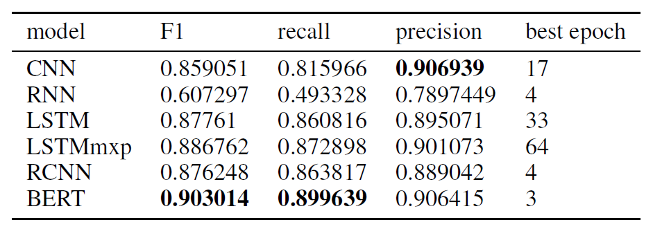
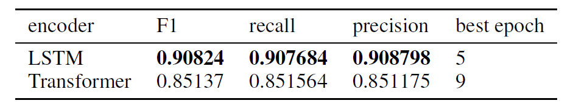

# Information Extraction 

[2019 Language and Intelligence Challenge](http://lic2019.ccf.org.cn/): Information Extraction 

## Prerequisites

* Install required packages by:
```angular2
pip install -r requirements.txt
```

## Data

## Idea

* Train multi-label classification model: predict predicate.
* Train sequence labeling model: input text and predicate, output text labeling.
* Extract SPO from sequence labeling result.

## Implementation

Check `report/PRML-final-project-doc-2019.pdf` for details.

### Multi-label Classification

* CNN, BiRNN, BiLSTM, BiLSTM with max pooling and RCNN
* BERT

### Sequence Labeling

* Encoder: BiLSTM and Transformer
* Decoder: CRF

## Result

### Multi-label Classification



### Sequence Labeling



## fitlog usage

* Initialize fitlog in `classification` folder:
```
cd classification/
fitlog init
fitlog log logs
```
* Initialize fitlog in `labeling` folder:
```
cd labeling/
fitlog init
fitlog log logs
```

## Author

Zhongyu Chen
